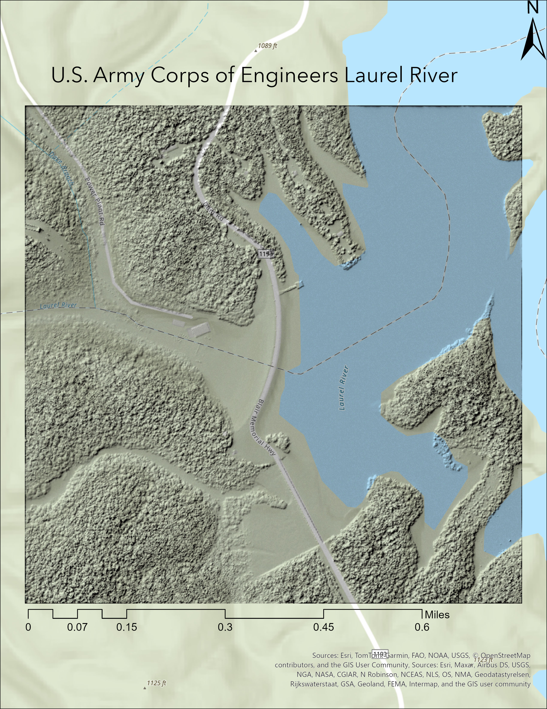

# Real-Laurel-River
 
# Visualizing the Laurel River Dam and Surrounding Terrain
## Laurel County, Kentucky

This visualization highlights the terrain surrounding the Laurel River Dam in southeastern Kentucky using a hillshade technique. The project aims to demonstrate the elevation differences and structure of the land around the dam area, emphasizing how topography influences water flow and dam infrastructure.

  
*Hillshade visualization of terrain around Laurel River Dam*

[Click here for high-resolution map (PDF)](LaurelRiver.pdf)

Additional resource: [Laurel River Dam structure information on Structurae](https://structurae.net/en/structures/laurel-river-dam)

**Author:** Brock Ittig  
**Data Sources:** Elevation data from [KYFromAbove](https://kyfromabove.ky.gov/), processed using ArcGIS Pro  
**Applications Used:** ArcGIS Pro, VS Code, GitHub Pages  
**Date:** April 21st 2025
